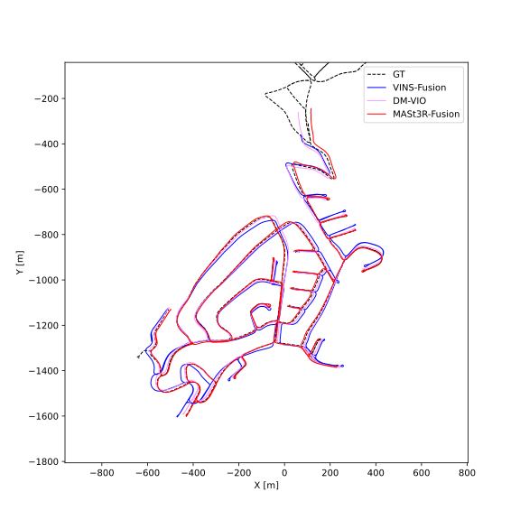
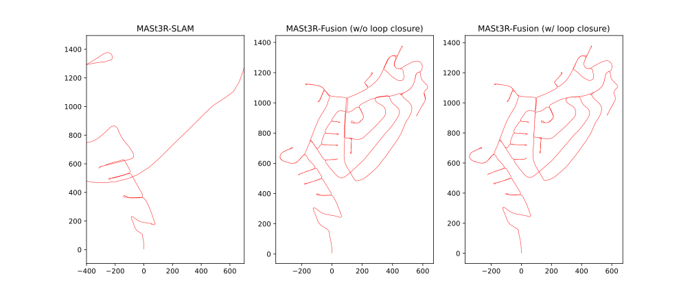

# MASt3R-Fusion

>High-Functionality Multi-Sensor SLAM without Bundle Adjustment.

[Coming soon...]

## What is this? 

MASt3R-Fusion is a SLAM system that tightly integrates feed-forward pointmap regression with multi-sensor data (e.g., IMU, GNSS), drawing inspiration from MASt3R-SLAM. It is designed for practical, large-scale 3D perception and mapping applications, and offers the following key features:

- ✅ High accuracy, high robustness, metric scale
- ✅ Full-view depth
- ✅ Multi-sensor fusion support
- ✅ Loop closure
- ✅ Real-time sliding window tracking + globally consistent optimization
- ✅ Auto calibration  

## Preview 

  
  

## Evaluation (Early-Stage)

<figure>
  
  <figcaption> Fig. 1 Monocular VIO performance on KITTI-360 0002. (Using evo-toolkit with global SE(3) alignment, no loop closure.) </figcaption>
</figure>

<figure>
  
  <figcaption> Fig. 2 Comparison with MASt3R-SLAM on KITTI-360 0002. </figcaption>
</figure>

